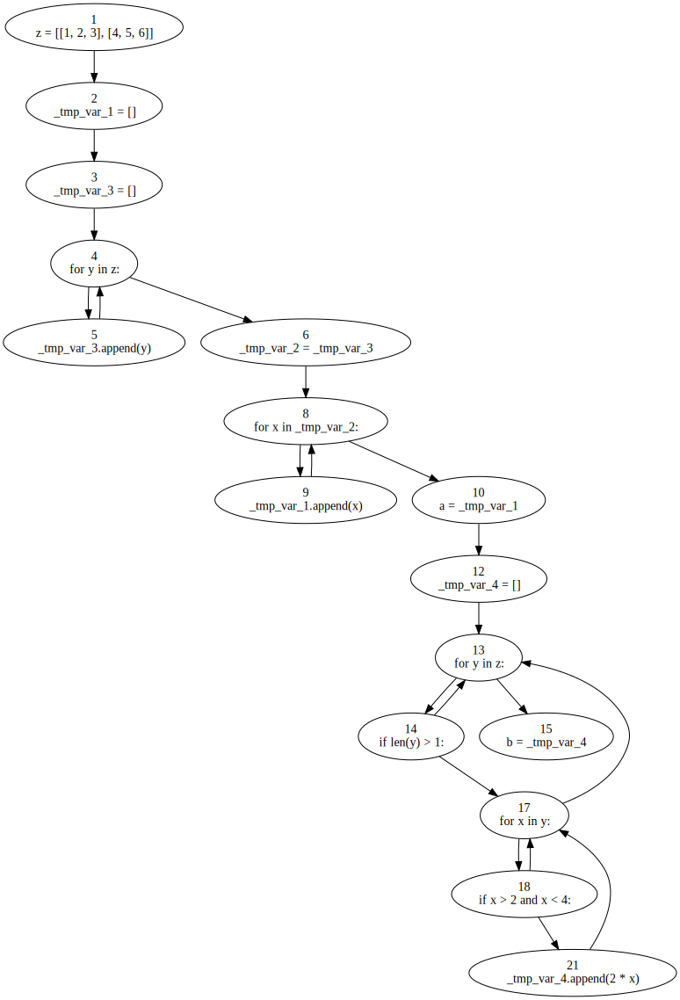
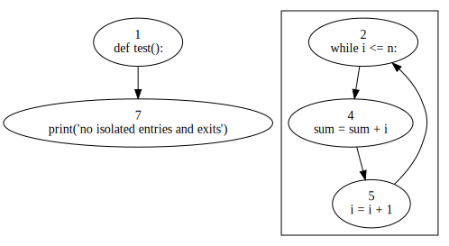
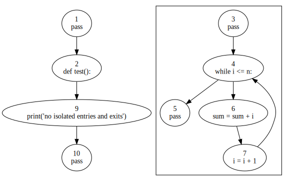

# py2flows

A control flow generator for Python that is able to generate control flow graphs and flows. The motivation behind this
project is to generate flows suitable for data flow analysis for Python.

## Supported language versions

### Python version

- [x] Python 3.7
- [] Python 3.8(Untested)
- [] Python 3.9(Untested)
- [] Python 3.10(Untested)

## Abstract Syntax Tree

### Modules

- [x] ast.Module

### Statements

- [x] ast.FunctionDef
- [] ast.AsyncFunctionDef
- [x] ast.ClassDef
- [x] ast.Return
- [] ast.Delete
- [x] ast.Assign
- [x] ast.AugAssign
- [x] ast.AnnAssign
- [x] ast.For
- [] ast.AsyncFor
- [x] ast.While
- [x] ast.If
- [] ast.With
- [] ast.AsyncWith
- [] ast.Raise
- [x] ast.Try
- [x] ast.Assert
- [x] ast.Import
- [x] ast.ImportFrom
- [] ast.Global
- [] ast.Nonlocal
- [x] ast.Expr
- [x] ast.Pass
- [x] ast.Break
- [x] ast.Continue

### Expressions

- [] ast.BoolOp
- [] ast.BinOp
- [] ast.UnaryOp
- [x] ast.Lambda
- [x] ast.IfExp
- [] ast.Dict
- [] ast.Set
- [x] ast.ListComp
- [x] ast.SetComp
- [x] ast.DictComp
- [x] ast.GeneratorExp
- [] ast.Await
- [x] ast.Yield
- [] ast.YieldFrom
- [] ast.Compare
- [x] ast.Call
- [] ast.Num
- [] ast.Str
- [] ast.FormattedValue
- [] ast.JoinedStr
- [] ast.Bytes
- [] ast.NameConstant
- [] ast.Ellipsis
- [] ast.Constant
- [x] ast.Attribute
- [] ast.Subscript
- [] ast.Starred
- [x] ast.Name
- [] ast.List
- [] ast.Tuple

Support for other statements and expressions will be added gradually.

### Additional features

- [x] Removal of comments and docstrings
- [x] Decomposition of complex statements
- []  Modules and packages
- [x] Isolated entries and exits

## How to use it

### Install

1. Install all dependencies listed in requirements.
2. Open a terminal and run `python setup.py install`
3. If step 2 succeeds, an executable file *py2flows* will be available.
4. `py2flows --help`

### Example 1

```python
# 12_listcomp.py
z = [[1, 2, 3], [4, 5, 6]]
a = [x for x in [y for y in z]]
b = [2 * x for y in z if len(y) > 1 for x in y if x > 2 if x < 4]
```



### Example 2

```python
def test():
    while i <= n:
        sum = sum + i
        i = i + 1


print("no isolated entries and exits")
```

> No isolated entries and exits



> Isolated entries and exits

